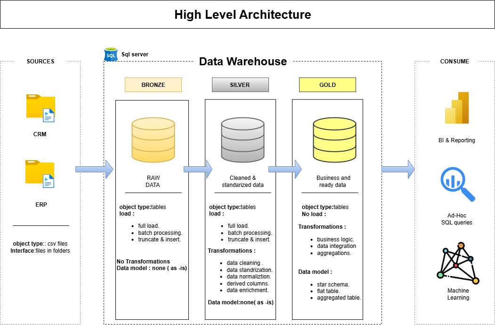

## Data Warehouse and Analytics Project

welcome to the **Data Warehouse and analytics project** repository!
This project demonstrates a comprehensive data warehousing and analytics solution,from building a data ware house to generating actionable insights.Designed as a portfolio project highlights industry best practices in data engineering and analytics.


-----
## 🏗️ Data Architecture
The data architecture for this project follows medallion architecture **Bronze**,**silver**,and **Gold** layers


1.**Bronze layer** : stores raw data as-is from the source system .Data is ingested from csv files into sql server database.

2.**Silver Layer** :This layer includes data cleaning,standardization and normaliztion processes to prepare data for analysis.

3.**Gold Layer**:Houses business_ready data model into star schema required for reporting and analytics.

---
## 📖 Project Overview
This project involves:

1.**Data Architecture** : Designing a modern data warehouse uding madallion architecture **Bronze** ,**Silver**,**Gold** Layers.

2.**ETL Pipelines** : Extracting,transforming,and loading data from source system into the warehouse.

3.**Data Modeling** :Developing fact and dimensions tables optimzed for analyticsal queries (Star Schema).

4.**Analytics & Repoting**: creating sql-based reports and dashboards for actionable insights.


## 🛠️ Important Links & Tools:

- **[Datasets](datasets/):** Access to the project dataset (csv files).
- **[SQL Server Express](https://www.microsoft.com/en-us/sql-server/sql-server-downloads):** Lightweight server for hosting your SQL database.
- **[SQL Server Management Studio (SSMS)](https://learn.microsoft.com/en-us/sql/ssms/download-sql-server-management-studio-ssms?view=sql-server-ver16):** GUI for managing and interacting with databases.
- **[Git Repository](https://github.com/):** Set up a GitHub account and repository to manage, version, and collaborate on your code efficiently.
- **[DrawIO](https://www.drawio.com/):** Design data architecture, models, flows, and diagrams.
- **[Notion Project Steps](https://www.notion.so/Data-Warehouse-Project-246dbefb730c8063bd61df0a41acbf01?source=copy_link):** Access to All Project Phases and Tasks.

## Project Requirements 

### Building the data warehouse (data engineering)

#### objective
Develop a modern data warehouse using sql server to consolidate sales data ,enabiling analytical reporting and informed descision making.

#### Specifications 
- **Data sources** : Import data from two source systems (ERP and CRM) provided as csv files.
- **Data Quality**: cleanse and resolve data quality issues prior analysis.
- **Integration** : combine both sources into a single ,user friendly data model for analytical queries.
- **Scope** : Focus on the latest dataset only ;historical of data is not required.
- **Documentation** : Provide clear documentation of the data model to support both business stakeholders and analytics teams.
---
### BI :Analytics & Reporting (data analytics)

#### objective 
Develop sql-based analytics to deliver detailed insigths into:
- **customer behavior**
- **product performance**
- **sales Trends**

These insights empower stakeholders with key busioness metrice ,enabilig strategic decision-making.

## 📂 Repository Structure
```
data-warehouse-project/
│
├── datasets/                           # Raw datasets used for the project (ERP and CRM data)
│
├── docs/                               # Project documentation and architecture details
│   ├── etl.drawio                      # Draw.io file shows all different techniquies and methods of ETL
│   ├── data_architecture.drawio        # Draw.io file shows the project's architecture
│   ├── data_catalog.md                 # Catalog of datasets, including field descriptions and metadata
│   ├── data_flow.drawio                # Draw.io file for the data flow diagram
│   ├── data_models.drawio              # Draw.io file for data models (star schema)
│   ├── naming-conventions.md           # Consistent naming guidelines for tables, columns, and files
│
├── scripts/                            # SQL scripts for ETL and transformations
│   ├── bronze/                         # Scripts for extracting and loading raw data
│   ├── silver/                         # Scripts for cleaning and transforming data
│   ├── gold/                           # Scripts for creating analytical models
│
├── tests/                              # Test scripts and quality files
│
├── README.md                           # Project overview and instructions
├── LICENSE                             # License information for the repository
├── .gitignore                          # Files and directories to be ignored by Git
└── requirements.txt                    # Dependencies and requirements for the project
```
---
---
## License

This project is licensed under the [MIT License ].(LICENSE).You are free to use ,modify ,and sahre this project with proper attribution.

## About Me

Hi there! I'm **Chinnala Nithish Yadav** , currently pursing B.tech final year .I'm an data analyst and passionate about data and deep-seated to extract meaningful insights and knowledge from the information.
